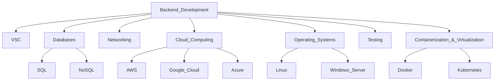

```mermaid
graph TB
    Backend_Development --> VSC
    Backend_Development --> Databases
    Databases --> SQL
    Databases --> NoSQL
    Backend_Development --> Networking
    Backend_Development --> Cloud_Computing
    Cloud_Computing --> AWS
    Cloud_Computing --> Google_Cloud
    Cloud_Computing --> Azure
    Backend_Development --> Operating_Systems
    Operating_Systems --> Linux
    Operating_Systems --> Windows_Server
    Backend_Development --> Testing
    Backend_Development --> Containerization_&_Virtualization
    Containerization_&_Virtualization --> Docker
    Containerization_&_Virtualization --> Kubernetes
```