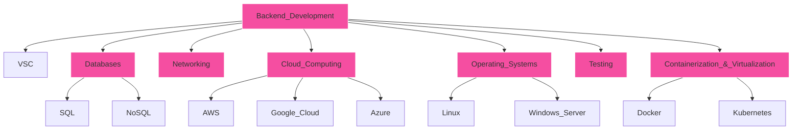

```mermaid
graph TB
    Backend_Development --> VSC
    Backend_Development --> Databases
    Databases --> SQL
    Databases --> NoSQL
    Backend_Development --> Networking
    Backend_Development --> Cloud_Computing
    Cloud_Computing --> AWS
    Cloud_Computing --> Google_Cloud
    Cloud_Computing --> Azure
    Backend_Development --> Operating_Systems
    Operating_Systems --> Linux
    Operating_Systems --> Windows_Server
    Backend_Development --> Testing
    Backend_Development --> Containerization_&_Virtualization
    Containerization_&_Virtualization --> Docker
    Containerization_&_Virtualization --> Kubernetes
    style Backend_Development fill:#F54EA1,stroke:#FFFFFF
    style Databases fill:#F54EA1,stroke:#FFFFFF
    style Networking fill:#F54EA1,stroke:#FFFFFF
    style Cloud_Computing fill:#F54EA1,stroke:#FFFFFF
    style Operating_Systems fill:#F54EA1,stroke:#FFFFFF
    style Testing fill:#F54EA1,stroke:#FFFFFF
    style Containerization_&_Virtualization fill:#F54EA1,stroke:#FFFFFF
```