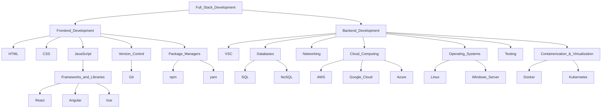

```mermaid
graph TB
    Full_Stack_Development --> Frontend_Development
    Frontend_Development --> HTML
    Frontend_Development --> CSS
    Frontend_Development --> JavaScript
    JavaScript --> Frameworks_and_Libraries
    Frameworks_and_Libraries --> React
    Frameworks_and_Libraries --> Angular
    Frameworks_and_Libraries --> Vue
    Frontend_Development --> Version_Control
    Version_Control --> Git
    Frontend_Development --> Package_Managers
    Package_Managers --> npm
    Package_Managers --> yarn
    Full_Stack_Development --> Backend_Development
    Backend_Development --> VSC
    Backend_Development --> Databases
    Databases --> SQL
    Databases --> NoSQL
    Backend_Development --> Networking
    Backend_Development --> Cloud_Computing
    Cloud_Computing --> AWS
    Cloud_Computing --> Google_Cloud
    Cloud_Computing --> Azure
    Backend_Development --> Operating_Systems
    Operating_Systems --> Linux
    Operating_Systems --> Windows_Server
    Backend_Development --> Testing
    Backend_Development --> Containerization_&_Virtualization
    Containerization_&_Virtualization --> Docker
    Containerization_&_Virtualization --> Kubernetes
```