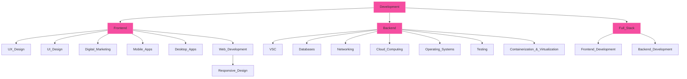

# What do you do?

> Created by Ximena Toledo
> 
> nov 12 2023

## Content

```mermaid
graph TB
    Development --> Frontend
    Frontend --> UX_Design
    Frontend --> UI_Design
    Frontend --> Digital_Marketing
    Frontend --> Mobile_Apps
    Frontend --> Desktop_Apps
    Frontend --> Web_Development
    Web_Development --> Responsive_Design
    Development --> Backend
    Backend --> VSC
    Backend --> Databases
    Backend --> Networking
    Backend --> Cloud_Computing
    Backend --> Operating_Systems
    Backend --> Testing
    Backend --> Containerization_&_Virtualization
    Development --> Full_Stack
    Full_Stack --> Frontend_Development
    Full_Stack --> Backend_Development
    style Development fill:#F54EA1,stroke:#ffcbdb
    style Frontend fill:#F54EA1,stroke:#ffcbdb
    style Backend fill:#F54EA1,stroke:#ffcbdb
    style Full_Stack fill:#F54EA1,stroke:#ffcbdb
```

1. [Frontend](./Module_1/1.md)