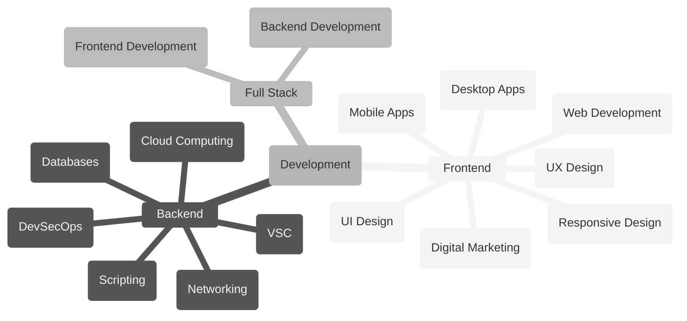

# What do you do?

## Contenido

```mermaid
%%{init: {'theme':'neutral'}}%%
mindmap
root (Development)
 Frontend 
  (UX Design)
  (UI Design)
  (Digital Marketing)
  (Mobile Apps)
  (Desktop Apps)
  (Web Development)
  (Responsive Design)
 Backend 
  (VSC)
  (Scripting)
  (Databases)
  (DevSecOps)
  (Networking)
  (Cloud Computing)
 Full Stack 
  (Frontend Development)
  (Backend Development)
```
